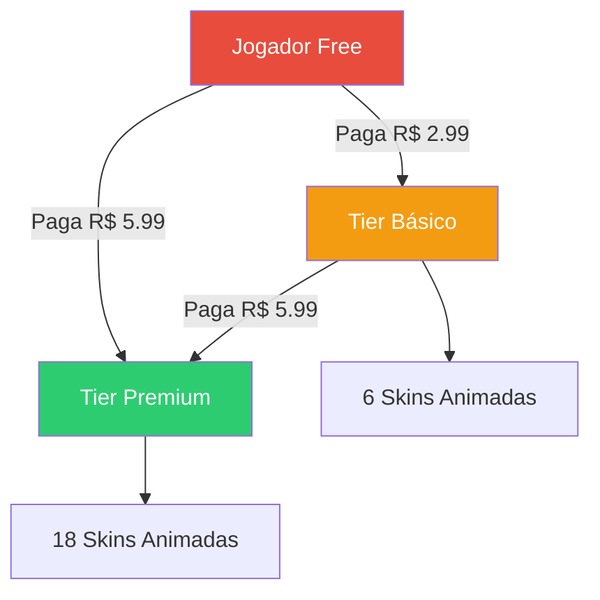
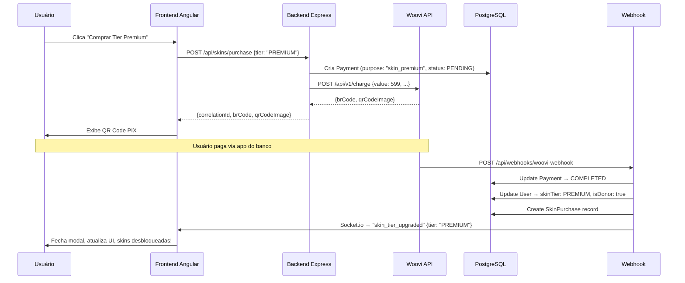

# 🎮 Plano: Sistema de Seleção e Compra de Skins

> **Status**: ✅ Aprovado — Pronto para implementação  
> **Data**: 2026-08-19  
> **Autor**: Antigravity AI  

---

## 📋 Índice

1. [Visão Geral](#1-visão-geral)
2. [Descobertas da Pesquisa](#2-descobertas-da-pesquisa)
3. [Arquitetura dos Tiers](#3-arquitetura-dos-tiers)
4. [Inventário de Skins](#4-inventário-de-skins)
5. [Alterações no Banco de Dados](#5-alterações-no-banco-de-dados)
6. [Backend — Novas APIs](#6-backend--novas-apis)
7. [Frontend — Novos Componentes](#7-frontend--novos-componentes)
8. [Integração com Pagamento (Woovi PIX)](#8-integração-com-pagamento-woovi-pix)
9. [Integração com o Jogo (Three.js)](#9-integração-com-o-jogo-threejs)
10. [Fluxo Completo do Usuário](#10-fluxo-completo-do-usuário)
11. [Segurança e Validação](#11-segurança-e-validação)
12. [Fases de Implementação](#12-fases-de-implementação)
13. [Testes](#13-testes)
14. [Questões em Aberto](#14-questões-em-aberto)

---

## 1. Visão Geral

Implementar um sistema onde jogadores possam **comprar e selecionar skins** para seus personagens no jogo Bomberman 3D. O sistema terá dois tiers de acesso baseados no valor pago via PIX (Woovi):

| Tier | Preço | Acesso |
|------|-------|--------|
| **Básico** | R$ 2,99 | 6 skins animadas (subconjunto selecionado) |
| **Premium** | R$ 5,99 | Todas as 18 skins animadas (catálogo completo) |

O jogador gratuito continua usando o personagem padrão (`character-d.glb`).

---

## 2. Descobertas da Pesquisa

### Assets Disponíveis

> **IMPORTANTE**: **Todos os 18 modelos GLB são animados** (27 animações cada, 143 vértices, 5 grupos).  
> Modelos estáticos existem apenas no formato OBJ em `Models/OBJ/`.

- **18 personagens**: `character-a` até `character-r`
- **Previews**: Imagens PNG em `Previews/` (para thumbnails no seletor)
- **Texturas**: 18 texturas PNG em `Models/GLB/Textures/`
- **Licença**: CC0 (uso livre)

### Sistema Atual

| Componente | Estado |
|-----------|--------|
| Pagamento Woovi (PIX) | ✅ Implementado (charge + webhook) |
| Modelo `Payment` no DB | ✅ Existe (correlationId, value, status) |
| Campo `User.donorAvatars` | ✅ Existe no schema (int, default 0) |
| Campo `User.isDonor` | ✅ Existe |
| Socket.io (real-time) | ✅ Configurado |
| `AuthService` (frontend) | ✅ Com signals `isDonor`, `userEmail` |
| `PixPaymentComponent` | ✅ Existe (mas não está no fluxo principal) |
| Seletor de Skins | ❌ Não existe |
| Inventário de Skins | ❌ Não existe |
| Roteamento Angular | ❌ Não configurado (app renderiza `<app-game />` direto) |

### Modelo do Jogador no Jogo

- **Player**: Hardcoded como `character-d.glb` em `SceneBuilderService`
- **Enemies**: Aleatório entre 6 modelos (`g`, `h`, `l`, `o`, `p`, `r`)

---

## 3. Arquitetura dos Tiers

### Tier Gratuito (Free)
- Personagem padrão: `character-d.glb` (animado)
- Sem acesso ao seletor de skins
- Vê overlay de paywall (10s cooldown)

### Tier Básico — R$ 2,99
- **Desbloqueia 6 skins animadas** (subconjunto dos personagens)
- Modelos GLB com animações completas (mesmo formato do Premium)
- Acesso ao **Seletor de Skins** com preview animado
- Remove paywall de anúncios

### Tier Premium — R$ 5,99
- **Desbloqueia todas as 18 skins animadas**
- Modelos GLB completos com 27 animações (idle, walk, jump, etc.)
- Acesso ao **Seletor de Skins** com preview animado (modelo 3D girando)
- Pode trocar de skin a qualquer momento entre partidas
- Remove paywall de anúncios

### Upgrade de Tier
- Quem já pagou R$ 2,99 e paga R$ 5,99 recebe upgrade automático para Premium
- Valor **não é cumulativo** (paga o valor cheio do novo tier)



---

## 4. Inventário de Skins

### Catálogo Completo

| ID | Arquivo | Nome Sugerido | Tier Básico | Tier Premium |
|----|---------|---------------|:-----------:|:------------:|
| `skin-a` | `character-a` | Aventureiro | ✅ | ✅ |
| `skin-b` | `character-b` | Explorador | ✅ | ✅ |
| `skin-c` | `character-c` | Guerreiro | ✅ | ✅ |
| `skin-d` | `character-d` | Clássico (padrão) | 🆓 Free | 🆓 Free |
| `skin-e` | `character-e` | Engenheiro | ✅ | ✅ |
| `skin-f` | `character-f` | Cientista | ❌ | ✅ |
| `skin-g` | `character-g` | Guardião | ❌ | ✅ |
| `skin-h` | `character-h` | Cavaleiro | ❌ | ✅ |
| `skin-i` | `character-i` | Ninja | ✅ | ✅ |
| `skin-j` | `character-j` | Pirata | ✅ | ✅ |
| `skin-k` | `character-k` | Robô | ❌ | ✅ |
| `skin-l` | `character-l` | Mago | ❌ | ✅ |
| `skin-m` | `character-m` | Samurai | ❌ | ✅ |
| `skin-n` | `character-n` | Viking | ❌ | ✅ |
| `skin-o` | `character-o` | Fantasma | ❌ | ✅ |
| `skin-p` | `character-p` | Dragão | ❌ | ✅ |
| `skin-q` | `character-q` | Alienígena | ❌ | ✅ |
| `skin-r` | `character-r` | Demônio | ❌ | ✅ |

> **NOTA**: O Tier Básico dá acesso a **6 skins animadas** (a, b, c, e, i, j) + a skin padrão (d).
> Os 11 personagens restantes são exclusivos do Tier Premium, incluindo os 6 usados como inimigos (`g`, `h`, `l`, `o`, `p`, `r`), criando forte incentivo de upgrade.

---

## 5. Alterações no Banco de Dados

### 5.1 Novo Enum: `SkinTier`

```prisma
enum SkinTier {
  FREE
  BASIC
  PREMIUM
}
```

### 5.2 Atualização do Modelo `User`

```prisma
model User {
  // ... campos existentes ...
  isDonor      Boolean   @default(false)
  donorAvatars Int       @default(0)     // REMOVER ou deprecar
  
  // NOVOS CAMPOS
  skinTier     SkinTier  @default(FREE)
  selectedSkin String    @default("character-d")  // skin atualmente equipada
  
  payments     Payment[]
  skinPurchases SkinPurchase[]
}
```

### 5.3 Novo Modelo: `SkinPurchase`

Registra o histórico de compras de tier de skins do usuário.

```prisma
model SkinPurchase {
  id            String    @id @default(cuid())
  userId        String
  user          User      @relation(fields: [userId], references: [id])
  tier          SkinTier
  amountPaid    Int       // valor em centavos
  paymentId     String    @unique
  payment       Payment   @relation(fields: [paymentId], references: [id])
  createdAt     DateTime  @default(now())

  @@index([userId])
}
```

### 5.4 Atualização do Modelo `Payment`

```prisma
model Payment {
  // ... campos existentes ...
  
  // NOVO CAMPO — tipo do pagamento para distinguir doação de compra de skin
  purpose       String    @default("donation")  // "donation" | "skin_basic" | "skin_premium"
  
  skinPurchase  SkinPurchase?
}
```

### 5.5 Migration

```bash
npx prisma migrate dev --name add-skin-system
```

---

## 6. Backend — Novas APIs

### 6.1 Arquivo: `src/routes/skinRoutes.ts`

#### `GET /api/skins/catalog`
Retorna o catálogo de skins disponíveis com informações de tier.

```typescript
// Response
{
  skins: [
    {
      id: "skin-a",
      name: "Aventureiro",
      model: "character-a",
      previewImage: "/assets/kenney_blocky-characters_20/Previews/character-a.png",
      glbPath: "/assets/kenney_blocky-characters_20/Models/GLB/character-a.glb",
      requiredTier: "BASIC",  // FREE | BASIC | PREMIUM
    },
    // ...
  ],
  tiers: {
    BASIC: { price: 299, label: "Básico", skinCount: 6 },
    PREMIUM: { price: 599, label: "Premium", skinCount: 18 },
  }
}
```

#### `GET /api/skins/my-skins` (autenticado)
Retorna as skins desbloqueadas do usuário e a skin selecionada.

```typescript
// Response
{
  currentTier: "BASIC",
  selectedSkin: "character-d",
  unlockedSkins: ["character-d", "character-a", "character-b", ...],
}
```

#### `POST /api/skins/select` (autenticado)
Permite ao usuário selecionar uma skin desbloqueada.

```typescript
// Request
{ skinId: "character-a" }

// Response
{ success: true, selectedSkin: "character-a" }

// Erro: skin não desbloqueada
{ success: false, error: "SKIN_LOCKED", requiredTier: "PREMIUM" }
```

#### `POST /api/skins/purchase` (autenticado)
Inicia o fluxo de compra de um tier de skins via PIX.

```typescript
// Request
{ tier: "BASIC" }  // ou "PREMIUM"

// Response (sucesso)
{
  success: true,
  correlationId: "uuid-xxx",
  payment: {
    brCode: "00020126...",
    qrCodeImage: "data:image/png;base64,...",
    amount: 299,  // centavos
    tier: "BASIC",
  }
}

// Erro: já possui tier igual ou superior
{ success: false, error: "ALREADY_OWNED" }
```

### 6.2 Arquivo: `src/services/skinService.ts`

Serviço backend com a lógica de negócio:

```typescript
class SkinService {
  // Retorna catálogo completo com tier requirements
  getCatalog(): SkinCatalogItem[]
  
  // Retorna skins desbloqueadas baseado no tier do usuário
  getUnlockedSkins(userId: string): Promise<UnlockedSkinsResponse>
  
  // Valida e seleciona skin
  selectSkin(userId: string, skinId: string): Promise<SelectSkinResult>
  
  // Processa upgrade de tier após pagamento confirmado
  upgradeTier(userId: string, tier: SkinTier, paymentId: string, amount: number): Promise<void>
  
  // Verifica se usuário tem acesso a determinada skin
  canUseSkin(userId: string, skinId: string): Promise<boolean>
}
```

### 6.3 Atualização do Webhook (`src/routes/webhookRoutes.ts`)

Ao receber `OPENPIX:CHARGE_COMPLETED`, verificar o campo `purpose` do `Payment`:

```
Se purpose === "skin_basic" ou "skin_premium":
  → Chamar skinService.upgradeTier(...)
  → Emitir evento Socket.io "skin_tier_upgraded" para o usuário
  → Também marca como isDonor (se ainda não for)
  
Se purpose === "donation":
  → Fluxo atual (markUserAsDonor)
```

---

## 7. Frontend — Novos Componentes

### 7.1 Configuração de Rotas

Adicionar roteamento Angular para suportar navegação entre tela do jogo e loja de skins:

```typescript
// src/app/app.routes.ts
export const routes: Routes = [
  { path: '', component: GameComponent },
  { path: 'skins', component: SkinShopComponent },
];
```

Atualizar `app.ts` para usar `<router-outlet>` em vez de `<app-game />` direto.

### 7.2 Componente: `SkinShopComponent`

**Localização**: `src/app/components/skin-shop/`

**Responsabilidades**:
- Exibir grid de skins disponíveis com thumbnails (imagens de `Previews/`)
- Indicar visualmente quais estão desbloqueadas vs. bloqueadas
- Mostrar badges de tier (🆓 Free / 🟡 Básico / 🟢 Premium)
- Botão "Comprar Tier Básico — R$ 2,99" e "Comprar Tier Premium — R$ 5,99"
- Ao clicar em skin desbloqueada → seleciona
- Ao clicar em skin bloqueada → mostra modal de compra do tier necessário
- Botão "Voltar ao Jogo"

**Layout sugerido**:

```
┌─────────────────────────────────────────────────┐
│  🎭 Loja de Skins           [Voltar ao Jogo →]  │
├─────────────────────────────────────────────────┤
│  Seu Tier: ⭐ Básico    Skin Atual: Aventureiro │
├─────────────────────────────────────────────────┤
│                                                  │
│  ┌─────┐ ┌─────┐ ┌─────┐ ┌─────┐ ┌─────┐      │
│  │  A  │ │  B  │ │  C  │ │ D🆓 │ │  E  │      │
│  │ ✅  │ │ ✅  │ │ ✅  │ │ ✅  │ │ ✅  │      │
│  └─────┘ └─────┘ └─────┘ └─────┘ └─────┘      │
│  ┌─────┐ ┌─────┐ ┌─────┐ ┌─────┐ ┌─────┐      │
│  │  F  │ │ G🔒 │ │ H🔒 │ │  I  │ │  J  │      │
│  │ ✅  │ │ 🟢  │ │ 🟢  │ │ ✅  │ │ ✅  │      │
│  └─────┘ └─────┘ └─────┘ └─────┘ └─────┘      │
│  ┌─────┐ ┌─────┐ ┌─────┐ ┌─────┐ ┌─────┐      │
│  │  K  │ │ L🔒 │ │  M  │ │  N  │ │ O🔒 │      │
│  │ ✅  │ │ 🟢  │ │ ✅  │ │ ✅  │ │ 🟢  │      │
│  └─────┘ └─────┘ └─────┘ └─────┘ └─────┘      │
│  ┌─────┐ ┌─────┐ ┌─────┐                        │
│  │ P🔒 │ │  Q  │ │ R🔒 │                        │
│  │ 🟢  │ │ ✅  │ │ 🟢  │                        │
│  └─────┘ └─────┘ └─────┘                        │
│                                                  │
├─────────────────────────────────────────────────┤
│  [🟡 Tier Básico — R$ 2,99]                     │
│  [🟢 Tier Premium — R$ 5,99]                    │
└─────────────────────────────────────────────────┘
```

### 7.3 Componente: `SkinPreviewComponent`

**Localização**: `src/app/components/skin-preview/`

**Responsabilidades**:
- Renderizar preview 3D do personagem selecionado usando Three.js
- Modelo GLB animado (idle animation) girando lentamente
- Ambos os tiers usam modelos animados (mesma experiência visual)
- Canvas separado do jogo (menor, ~300x400px)
- Fundo com gradiente ou cor sólida neutra

### 7.4 Componente: `SkinPurchaseModalComponent`

**Localização**: `src/app/components/skin-purchase-modal/`

**Responsabilidades**:
- Modal overlay com informações do tier
- Exibe QR Code PIX (reutiliza lógica do `PixPaymentComponent`)
- Código PIX copia-e-cola
- Listener Socket.io para `skin_tier_upgraded` → fecha modal, atualiza UI
- Timer de expiração do PIX (se aplicável)
- Botão cancelar

### 7.5 Serviço: `SkinService` (Frontend)

**Localização**: `src/app/services/skin.service.ts`

```typescript
@Injectable({ providedIn: 'root' })
export class SkinService {
  // Signals
  currentTier = signal<SkinTier>('FREE');
  selectedSkin = signal<string>('character-d');
  unlockedSkins = signal<string[]>(['character-d']);
  catalog = signal<SkinCatalogItem[]>([]);

  // Métodos
  loadCatalog(): Observable<SkinCatalog>
  loadMySkins(): Observable<MySkinsResponse>
  selectSkin(skinId: string): Observable<SelectResult>
  purchaseTier(tier: SkinTier): Observable<PurchaseResult>
  
  // Helpers
  isSkinUnlocked(skinId: string): boolean
  getSkinTierRequirement(skinId: string): SkinTier
}
```

### 7.6 Atualização do `GameComponent`

- Adicionar botão "🎭 Skins" no HUD (visível quando autenticado)
- O botão navega para `/skins` via Router
- Alternativamente, abre o seletor como overlay/modal sem roteamento

### 7.7 Atualização do `AuthService`

- Adicionar signal `skinTier: Signal<SkinTier>`
- Atualizar `checkSession()` para incluir `skinTier` e `selectedSkin` na resposta
- Escutar evento Socket.io `skin_tier_upgraded` para atualizar tier em tempo real

---

## 8. Integração com Pagamento (Woovi PIX)

### Fluxo de Compra



### Valores em Centavos

| Tier | Valor (R$) | Valor (centavos) | Campo `purpose` |
|------|-----------|------------------|-----------------|
| Básico | R$ 2,99 | `299` | `skin_basic` |
| Premium | R$ 5,99 | `599` | `skin_premium` |

---

## 9. Integração com o Jogo (Three.js)

### 9.1 Atualização do `SceneBuilderService`

**Mudança principal**: O modelo do player não é mais hardcoded.

```typescript
// ANTES
private readonly PLAYER_MODEL = '/assets/.../character-d.glb';

// DEPOIS
private playerModelPath = signal('/assets/.../character-d.glb');

// Método para trocar skin
setPlayerSkin(characterId: string): void {
  this.playerModelPath.set(
    `/assets/kenney_blocky-characters_20/Models/GLB/${characterId}.glb`
  );
  this.reloadPlayerModel();
}
```

### 9.2 Lógica de Carregamento

```
1. Na inicialização do GameComponent:
   → skinService.loadMySkins()
   → sceneBuilder.setPlayerSkin(selectedSkin)

2. Ao trocar skin no seletor:
   → skinService.selectSkin(newSkin)
   → sceneBuilder.setPlayerSkin(newSkin)
   → Pré-carregar modelo GLB em cache (GLTFLoader)

3. Carregamento (ambos os tiers são animados):
   → Carregar GLB COM AnimationMixer
   → Tocar animações: idle, walk, jump conforme estado do jogo
   → Transições suaves entre animações (crossFade)
   → A diferença entre tiers é apenas QUAIS skins estão disponíveis,
     não COMO elas são renderizadas
```

### 9.3 Cache de Modelos

Para evitar recarregar modelos ao trocar skins frequentemente:

```typescript
private modelCache = new Map<string, GLTF>();

async preloadSkin(characterId: string): Promise<void> {
  if (this.modelCache.has(characterId)) return;
  const gltf = await this.gltfLoader.loadAsync(this.getModelPath(characterId));
  this.modelCache.set(characterId, gltf);
}
```

---

## 10. Fluxo Completo do Usuário

### Cenário 1: Jogador novo quer comprar skins

```
1. Jogador acessa o jogo → vê personagem padrão (character-d)
2. Clica no botão "🎭 Skins" no HUD
3. É redirecionado para login (Google/Microsoft) se não autenticado
4. Vê o catálogo de skins com previews
5. Tenta clicar em skin bloqueada → modal explica tiers
6. Clica "Comprar Tier Básico — R$ 2,99"
7. Modal de pagamento PIX aparece com QR Code
8. Paga via app do banco
9. Em tempo real: modal fecha, skins desbloqueiam
10. Seleciona a skin desejada
11. Volta ao jogo com a nova skin aplicada
```

### Cenário 2: Jogador básico faz upgrade para Premium

```
1. Jogador com Tier Básico acessa a loja de skins
2. Vê 6 skins bloqueadas (exclusivas Premium) com badge 🟢
3. Clica "Upgrade para Premium — R$ 5,99"
4. Paga via PIX
5. Todas as 18 skins são desbloqueadas com animações
6. Personagem agora tem animações completas no jogo
```

---

## 11. Segurança e Validação

### Backend

- [ ] **Autenticação obrigatória** em todas as rotas `/api/skins/*` (exceto `catalog`)
- [ ] **Validação server-side** de que o usuário tem o tier necessário ao selecionar skin
- [ ] **Validação de tier** antes de criar charge (não permitir comprar tier já possuído)
- [ ] **Idempotência no webhook** — se o pagamento já foi processado, ignorar
- [ ] **Rate limiting** nas rotas de purchase para evitar spam de charges

### Frontend

- [ ] **Verificação client-side** é apenas UX — toda validação real é no backend
- [ ] **Não expor paths de modelos** para skins não desbloqueadas (o catálogo retorna paths apenas para skins que o usuário pode usar)
- [ ] **Proteção SSR** — componentes Three.js só rodam no browser (`isPlatformBrowser`)

### Anti-Fraude

- [ ] Modelo do player é validado no backend antes de cada partida (futuro, se multiplayer)
- [ ] O `selectedSkin` salvo no DB é a fonte de verdade
- [ ] O frontend não pode forçar um modelo arbitrário — o `SceneBuilderService` lê do `SkinService` que sincroniza com o backend

---

## 12. Fases de Implementação

### Fase 1 — Fundação (Backend + DB) 🔵
**Estimativa**: ~4-6h

1. Atualizar `schema.prisma` com novos modelos e enum
2. Rodar migration
3. Criar `src/services/skinService.ts`
4. Criar `src/routes/skinRoutes.ts` com todas as rotas
5. Atualizar webhook para tratar `purpose` do pagamento
6. Atualizar `GET /api/user` para incluir `skinTier` e `selectedSkin`
7. Testes unitários do `SkinService`

### Fase 2 — Frontend: Loja de Skins 🟡
**Estimativa**: ~6-8h

1. Configurar Angular Router (`app.routes.ts`)
2. Criar `SkinService` (frontend)
3. Criar `SkinShopComponent` com grid de skins
4. Criar `SkinPreviewComponent` (preview 3D)
5. Criar `SkinPurchaseModalComponent` (integração PIX)
6. Atualizar `AuthService` com signals de skin
7. Adicionar botão "Skins" no `GameComponent`

### Fase 3 — Integração com o Jogo 🟢
**Estimativa**: ~3-4h

1. Atualizar `SceneBuilderService` para suportar troca de skin dinâmica
2. Implementar cache de modelos GLB
3. Implementar `AnimationMixer` com transições (idle/walk/jump)
4. Sincronizar skin selecionada ao iniciar partida
5. Testes de integração

### Fase 4 — Polish e UX ✨
**Estimativa**: ~2-3h

1. Animações de transição na loja
2. Feedback visual ao desbloquear skins (confetti/particles)
3. Sound effects na seleção
4. Responsividade mobile da loja
5. Loading states e error handling

**Total estimado**: ~15-21h de desenvolvimento

---

## 13. Testes

### Unitários (Vitest)

| Arquivo | O que testar |
|---------|-------------|
| `skinService.spec.ts` (backend) | Catálogo, unlock logic, tier upgrade, validação |
| `skinRoutes.spec.ts` | Rotas API, autenticação, respostas |
| `skin.service.spec.ts` (frontend) | Signals, state management, API calls |
| `webhook.spec.ts` | Processamento de pagamento skin vs donation |

### Integração

| Cenário | Validação |
|---------|-----------|
| Compra Tier Básico | Payment criado → webhook → tier atualizado → skins desbloqueadas |
| Upgrade para Premium | Tier anterior preservado → novo tier aplicado |
| Seleção de skin | Só permite skins do tier atual |
| Persistência | Skin selecionada persiste entre sessões |
| Real-time | Socket.io notifica upgrade de tier |

### E2E (futuro)

- Fluxo completo de compra com mock do Woovi
- Troca de skin reflete no canvas Three.js
- Navegação entre jogo ↔ loja

---

## 14. Questões em Aberto

> Todas as decisões foram resolvidas! ✅

### ✅ Decisões Resolvidas

1. ~~**Roteamento vs Modal**~~: → **Rota separada** (`/skins`)
2. ~~**Tier Básico — Estático vs Subconjunto Animado**~~: → **(b) Subconjunto menor de 6 skins animadas**
3. ~~**Nomes e aparência das skins**~~: → **Nomes aprovados** (Aventureiro, Explorador, Guerreiro, etc.)
4. ~~**Expiração de tier**~~: → **Permanente** (tanto Básico quanto Premium, uma vez pago, para sempre)
5. ~~**Skin no multiplayer**~~: → **Sim**, cada jogador vê a skin do outro. **E-mail exibido acima do personagem** para distinção caso ambos usem a mesma skin.
6. ~~**Skins de inimigo**~~: → **Randomizados**, podendo inclusive incluir a skin do adversário/jogador para aumentar a dificuldade (confusão visual intencional).
7. ~~**Botão de skins para não-autenticados**~~: → **Mostrar o botão**. Ao clicar, redireciona para login antes de acessar a loja.

---

> **DICA**: Este plano está pronto para revisão. Após alinhar as questões em aberto, posso começar a implementação pela **Fase 1 (Backend + DB)**.
